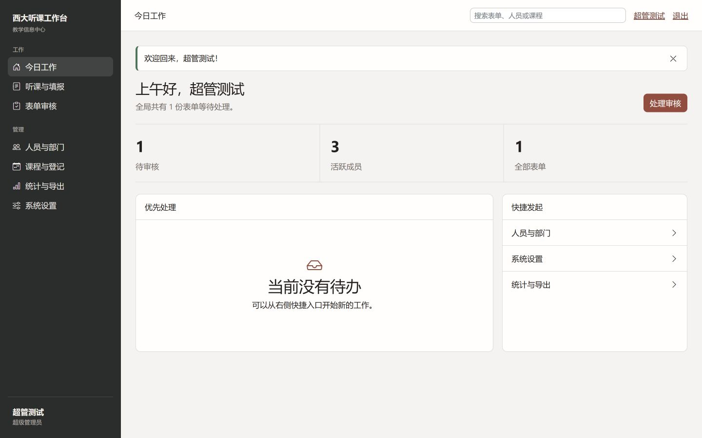
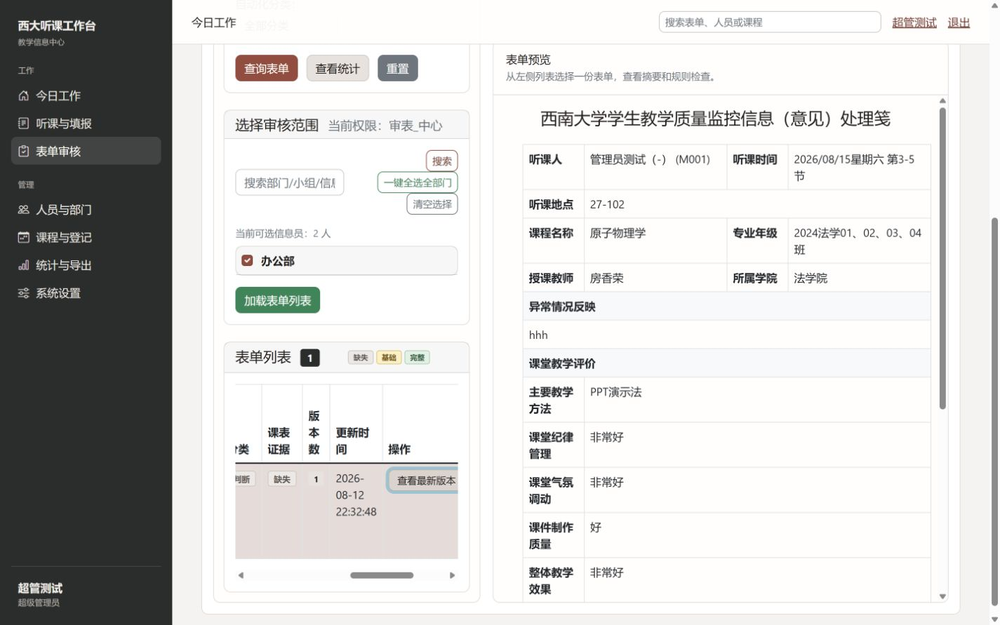
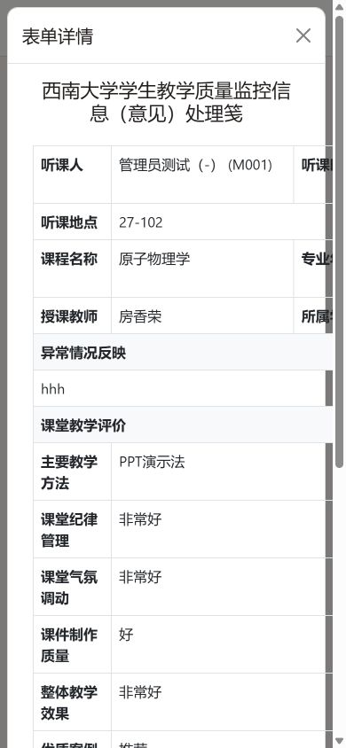
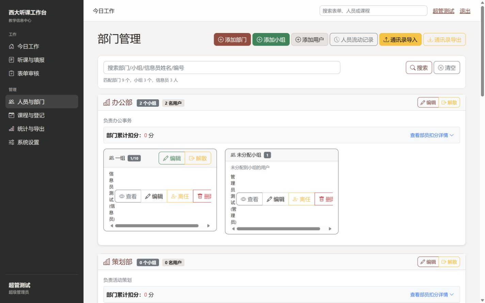
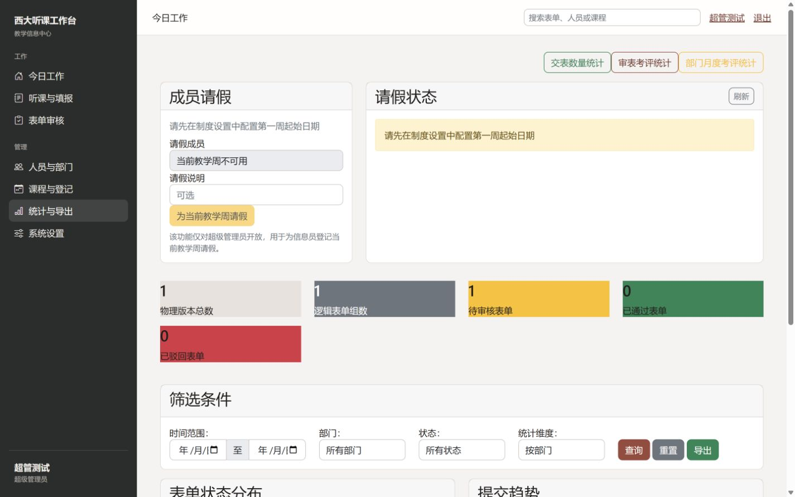
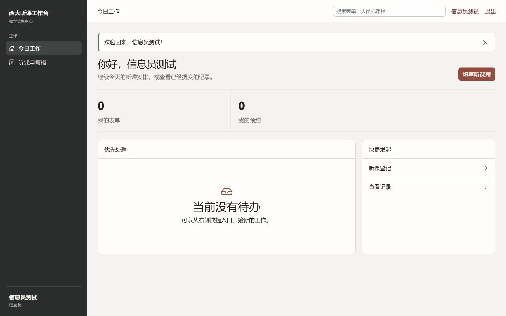
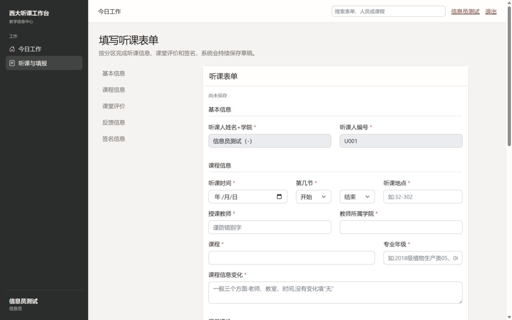
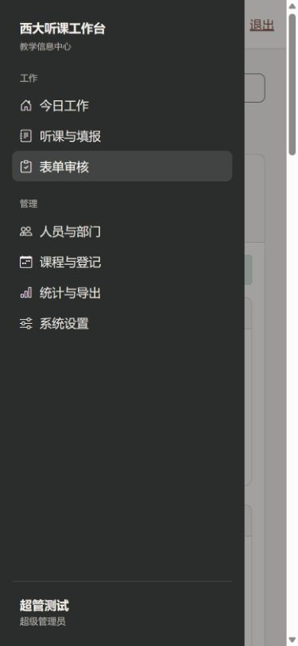

# SWU TIC Website UI/UX 深度审计与渐进式优化规划

> 审计窗口：2026-08-12 至 2026-08-13
> 代码基线：`youzi` / `294aa59`，与 `origin/youzi` 对齐
> 运行环境：隔离的本地调试数据库，`http://127.0.0.1:5087`
> 本轮边界：只读代码与运行态检查；未实施正式 UI 重构。仓库仅新增本报告和截图证据。

## 0. 结论先行

当前系统已经完成了“统一 Workspace Shell”的第一步，但尚未完成“高频业务页面和交互模型的统一”。它不是一个需要换技术栈或整体重做的项目；更准确的状态是：**壳层已形成、成熟交互可复用、业务页面仍横跨两个设计时代，少数关键 ViewModel 与响应式断点存在真实断裂**。

推荐路线是 `Refine → Consolidate → Migrate`：保留 Flask、Jinja、Bootstrap 5 和原生 JavaScript，先修复工作台任务语义与搜索行为，再补齐设计 token 和 canonical component，随后按风险迁移审核、人员/部门、课程、统计等高频旧页面，最后用真实浏览器回归收口。不要先从“换框架”“重做全部页面”或“新增全局全文搜索”开始。

本次审计的高置信结论如下：

1. 新 Workspace Shell 与旧 Bootstrap 业务页确实并存；这是一项跨模板、CSS 和交互脚本的系统性迁移未完成问题，而非单页配色问题。
2. 管理员工作台显示“1 个待审核”但同时显示“当前没有待办”，根因是 `pending_forms` 进入摘要而没有进入 `tasks` ViewModel。
3. 信息员只有两个指标时，三列固定网格留下完整空列；用 `auto-fit/minmax()` 比角色类名或 `auto-fill` 更稳妥。
4. 900–1024px 是当前体验断层：侧栏仍占 216px，而审核筛选、表格和表单被迫挤压；应采用 `<960px` drawer 的简单策略，不引入图标 rail。
5. 审核页的小屏预览并非完全丢失：现有 JS 会打开 modal，因此 H8 只部分成立；真正问题是 modal 仍沿用桌面多列表格，内容被裁切。
6. Topbar 搜索的 placeholder 暗示全局搜索，但当前仅指向表单列表，且实测 Enter 不触发可见导航或反馈；先修正文案和提交契约，不建设复杂全局搜索。
7. 当前 active state 足够清晰，H4 不成立；可选的 2–3px 朱红指示条只是抛光项，不应成为迁移前置条件。
8. Lecture Form 的章节导航、草稿/自动保存、sticky actions，审核桌面的分栏概念、移动 modal 上下文，以及 reduced-motion 等都值得保留。
9. 人员/部门、课程、统计、审核页仍大量使用装饰性色彩、页面内样式和超大模板；建议渐进抽取，而非一次性模板重构。
10. 本地 `/about` 与 `/help` 路由真实返回 500，因为路由存在而 `main/about.html`、`main/help.html` 缺失。这是独立于 UI 统一工作的路由完整性缺陷。

---

# 1. Executive Summary

## 1.1 成熟度判断

| 维度 | 判断 | 说明 |
|---|---|---|
| Shell 与导航 | 中等偏成熟 | 统一 sidebar/topbar/content shell 已覆盖登录后页面，角色导航由 Python 集中生成。 |
| 视觉系统 | 中等 | 已有墨黑/朱红/米白 token 和基础 Bootstrap 覆盖，但 typography、spacing、shadow、z-index、container、breakpoint 仍不完整。 |
| 高频业务页 | 中等偏低 | 审核、人员/部门、课程、统计仍保留旧 Bootstrap 卡片、彩色 utility 和页面内 CSS/JS。 |
| 表单体验 | 中等偏成熟 | Lecture Form 的分区导航、草稿与 sticky actions 表现稳定，适合作为其他长表单基线。 |
| 响应式 | 中等偏低 | 768px 以下已有 drawer，但 900–1024px 体验断层；复杂表格和详情内容没有真正重排。 |
| 无障碍 | 基础具备 | 有 `aria-live`、部分 modal/drawer、`prefers-reduced-motion`，但 drawer 焦点生命周期、无名控件和图标按钮仍有缺口。 |
| 自动化保障 | 中等 | 模板、路由、权限、草稿契约已有测试；没有 viewport、真实 DOM 或截图回归。 |

## 1.2 主要优势

- `base.html` 已提供一致的登录后 shell，导航项由 `app/ui/navigation.py` 根据角色/权限生成，避免模板内散落权限逻辑。
- 朱红 accent 使用克制，页面背景、边界和低阴影方向符合“专业、清晰、高信息密度”的目标。
- Activity Center、System Settings 和 Lecture Form 展现出可复用的 tab、PageHeader、原生搜索、反馈与长表单交互模式。
- 审核队列已具备返回上下文、桌面 split view、小屏 modal、局部 DOM 更新和草稿保护的业务基础。
- 已有测试保护共享 shell、禁止新窗口/浏览器原生对话框、草稿隔离、权限范围和人工审核关键字段。

## 1.3 主要架构问题

- 设计系统停留在“全局视觉覆盖”，尚未形成覆盖 PageHeader、Panel、Table、StatusBadge、FilterBar、EmptyState 的统一组件契约。
- 业务模板过大并混合 HTML、CSS 与 JS，增加局部修改的回归面；但这不构成更换框架的理由。
- Workspace 摘要和任务区由不同数据分支驱动，导致同屏语义矛盾。
- Breakpoint 以少量 media query 直接隐藏/挤压元素，缺少按组件和任务复杂度设计的响应式策略。
- “breadcrumb”“global search”等命名超出了实际能力，造成产品语义与实现契约不一致。

## 1.4 总体策略

无需大重构。以 P0 保护基线和修复行为矛盾，以 P1 建立 canonical primitives 并迁移高频页面，以 P2 清理兼容债务和次要一致性，Optional 仅做可验证的视觉抛光。任何迁移都必须保留现有 route、permission、草稿、审核字段和局部更新语义。

---

# 2. Current UI Architecture

## 2.1 模板继承与运行结构

```text
Flask blueprint / ViewModel
        │
        ├─ app/ui/navigation.py         角色/权限导航模型
        ├─ app/ui/workspace.py          工作台 snapshot、metrics、tasks、quick actions
        └─ app/app.py                   shell 上下文与 search action
                │
                ▼
app/templates/base.html                 登录后统一 Shell
        ├─ partials/_sidebar.html       persistent navigation + identity
        ├─ partials/_topbar.html        page context + search + user actions
        ├─ partials/_page_header.html   title/description/single CTA macro
        ├─ partials/_empty_state.html   reusable empty-state macro
        ├─ partials/_confirm_dialog.html reusable confirmation
        └─ page template                页面布局、局部 style、局部 script
                │
                ├─ app/static/css/style.css
                ├─ Bootstrap 5.1.3 + Bootstrap Icons
                └─ app/static/js/*.js + 大量页面内 JS
```

`base.html` 是登录后页面的主壳层；公共入口/登录使用独立 public shell。统一壳层本身是有效资产，问题主要发生在 `content` 内的旧页面结构和页面级样式。

## 2.2 核心实现映射

| 层 | 当前实现 | 观察 |
|---|---|---|
| Base Template | `app/templates/base.html` | sidebar、topbar、flash、确认 modal、jQuery、Bootstrap bundle、全局脚本统一注入。 |
| Workspace | `app/templates/main/workspace.html` + `app/ui/workspace.py` | 视觉统一，但摘要与 task list 的数据模型断裂。 |
| Sidebar | `app/templates/partials/_sidebar.html` | 角色导航集中、active state 可读；移动 drawer 缺焦点管理。 |
| Topbar | `app/templates/partials/_topbar.html` + `app/app.py` context processor | 当前页面标签、搜索、身份和退出；搜索语义与行为不一致。 |
| PageHeader | `app/templates/partials/_page_header.html` | 只支持标题、描述、单 CTA；约 16 个模板使用，高频管理页未统一。 |
| CSS | `app/static/css/style.css` | 283 行，已有基础 token；页面内 CSS 与 Bootstrap utility 继续形成第二套视觉。 |
| JS | `app/static/js/app-shell.js` 等 5 个文件 + 约 30 个含 inline script 的模板 | 新页面逐步外置，但旧复杂页仍是模板内单体交互。 |
| Bootstrap | vendor Bootstrap 5.1.3 | 可继续使用；存在少量 Bootstrap 4 API 残留，属于兼容风险而非已证实故障。 |

## 2.3 CSS 与 JS 形态

- `style.css` 负责颜色 token、shell、PageHeader、metrics、form nav、review preview 和 1024/768/480 响应规则；另有两个现成 macro：PageHeader 与 EmptyState。
- 代码静态扫描发现 5 个模板包含 `<style>`，模板中约 110 个 `style=`；`!important` 约 58 处，其中一部分是刻意覆盖 Bootstrap，不能机械删除。
- 最大模板：`course_feedback_management.html` 约 2767 行、`manage_departments.html` 约 2355 行、`review_forms.html` 约 2158 行、`review_form.html` 约 1648 行、`lecture_form.html` 约 879 行。
- 独立脚本中 `activity-center.js` 约 615 行、`automation-center.js` 约 502 行、`review-queue.js` 约 186 行、`app-shell.js` 约 78 行、`settings-center.js` 约 38 行。
- 结论：按页面迁移时提取局部 macro/partial 和外置 JS，避免先做跨仓库“大拆分”。

---

# 3. Page Inventory

以下清单覆盖真实仓库中的主要可视页面；171 条 Flask 规则中的大量 `/api/*` 按业务簇归并，不把每个 JSON endpoint 误写成独立页面。

## 3.1 公共与账户页

| 页面 | Route | 模板 | 角色 | 主任务 | 布局 / Shell | 旧 UI | 重要度 / 严重度 |
|---|---|---|---|---|---|---|---|
| 登录 | `/auth/login` | `auth/login.html` | 访客 | 登录 | Public shell | 少 | P0 / Low |
| 修改密码 | `/auth/change_password` | `auth/change_password.html` | 已登录用户 | 修改凭据 | Auth layout | 中 | P1 / Low |
| 关于 | `/about` | 缺失 `main/about.html` | 访客 | 查看信息 | 无法渲染 | N/A | P2 / High（route 500） |
| 帮助 | `/help` | 缺失 `main/help.html` | 访客 | 获取帮助 | 无法渲染 | N/A | P2 / High（route 500） |

## 3.2 所有登录角色

| 页面 | Route | 模板 | 角色 | 主任务 | 布局 / Shell | 旧 UI | 重要度 / 严重度 |
|---|---|---|---|---|---|---|---|
| 今日工作 | `/` | `main/workspace.html` | 信息员、各级管理员、超级管理员 | 看摘要并进入下一任务 | Workspace Shell | 少 | P0 / High |
| 个人资料 | `/user/profile` | `user/profile.html` | 全部登录用户 | 查看身份资料 | Workspace Shell | 少 | P1 / Low |
| 编辑资料 | `/user/edit_profile` | `user/edit_profile.html` | 全部登录用户 | 更新资料 | Workspace Shell + form | 中 | P1 / Low |

## 3.3 信息员页面

| 页面 | Route | 模板 | 主任务 | 布局 | 新 Shell | 旧 UI | 重要度 / 严重度 |
|---|---|---|---|---|---|---|---|
| 活动中心—登记 | `/user/listening_registration?tab=registration` | `user/activity_center.html` | 选课/登记 | tabs + table/cards | 是 | 少 | P0 / Medium |
| 活动中心—记录 | `/user/listening_registration?tab=records` | 同上 | 查表单与预约记录 | tabs + filters | 是 | 少 | P0 / Medium |
| 我的表单兼容入口 | `/user/my_forms` | redirect | 进入记录 tab | redirect | N/A | N/A | P1 / Low |
| 创建表单 | `/user/submit_form` | `user/lecture_form.html` | 填写讲座信息 | PageHeader + section nav + form | 是 | 少 | P0 / Medium |
| 编辑表单 | `/user/form/edit/<id>` | `user/lecture_form.html` | 修改草稿/已退回版本 | 同上 | 是 | 少 | P0 / Medium |
| 提交成功 | `/user/success/<id>` | `user/success.html` | 确认提交结果 | compact state | 是 | 少 | P1 / Low |
| 查看表单 | `/user/view_form/<id>` | 用户详情模板 | 查看已有表单 | detail | 是 | 中 | P1 / Medium |
| 课程反馈兼容入口 | `/user/course_feedback_management` | route 兼容 | 跳转/承接旧入口 | compatibility | 是 | 中 | P2 / Low |

## 3.4 管理员核心页面

| 页面 | Route | 模板 | 主要角色 | 主任务 | 布局 | 新 Shell | 旧 UI | 重要度 / 严重度 |
|---|---|---|---|---|---|---|---|---|
| 审核队列 | `/admin/review_forms` | `admin/review_forms.html` | 组/部门/中心/超级审核员 | 筛选并审核 | table + desktop split preview | 是 | 多 | P0 / High |
| 审核表单 | `/admin/review/form/<id>` | `admin/review_form.html` | 有权限审核员 | 检查详情并提交决定 | long form/detail + sticky toolbar | 是 | 多 | P0 / High |
| 管理详情兼容页 | `/admin/form/<id>` | 管理详情模板 | 管理员 | 查看表单 | detail | 是 | 中 | P1 / Medium |
| 表单管理 | `/admin/view_forms` | 管理表单列表模板 | 管理员 | 查询、导入、导出 | filters + table | 是 | 多 | P0 / Medium |
| 人员与部门 | `/admin/manage_departments` | `admin/manage_departments.html` | 管理员 | 用户/组/部门 CRUD 与调整 | nested cards + tables + modals | 是 | 多 | P0 / High |
| 小组管理兼容入口 | `/admin/manage_groups` | route/兼容结构 | 管理员 | 进入小组管理 | compatibility | 是 | 多 | P1 / Medium |
| 课程管理 | `/admin/course_management` | `admin/course_feedback_management.html` | 超级管理员 | 课程查询、列设置、预约/反馈、禁听教师 | dense table + controls/modals | 是 | 多 | P0 / High |
| 课程反馈兼容入口 | `/admin/course_feedback_management` | redirect 到 `course_management` | 超级管理员 | 兼容旧书签 | redirect | N/A | N/A | P2 / Low |
| 登记统计 | `/admin/registration_statistics` | 统计模板 | 管理员 | 查看登记统计 | metrics/table | 是 | 多 | P1 / Medium |
| 综合统计 | `/admin/statistics` | `admin/statistics.html` | 管理员 | 聚合统计入口 | colored metrics/cards | 是 | 多 | P1 / Medium |
| 审核考核统计 | `/admin/review-assessment-stats` | 独立统计模板 | 管理员 | 审核绩效 | filters/table | 是 | 多 | P1 / Medium |
| 提交数量统计 | `/admin/submission-count-stats` | 独立统计模板 | 管理员 | 提交量与快照 | filters/table | 是 | 多 | P1 / Medium |
| 部门月考核 | `/admin/department-monthly-assessment-stats` | 独立统计模板 | 管理员 | 部门考核/快照 | filters/table | 是 | 多 | P1 / Medium |
| 导出入口（占位） | `/admin/export_forms` | 无独立模板；flash 后重定向设置 | 超级管理员 | 当前提示“开发中” | redirect | N/A | N/A | P2 / Medium |
| 系统设置 | `/admin/system_management` | `admin/system_management.html` | 超级管理员 | 课程、教学月、自动审核、考核等设置 | PageHeader + tabs | 是 | 少 | P0 / Low |
| 自动审核 | `/admin/auto_review` | 自动化设置/上传模板 | 超级/中心管理员 | 配置、预览、创建批次 | panel + modal | 是 | 少/中 | P0 / High（业务风险） |
| 自动审核结果 | `/admin/auto_review/results` | 结果模板 | 超级/中心管理员 | 看批次进度与证据 | table/drawer/modal | 是 | 少/中 | P0 / High（业务风险） |
| 考核豁免兼容入口 | `/admin/assessment-exemption-settings` | settings 入口 | 超级管理员 | 进入对应设置 tab | redirect/tab | 是 | 少 | P1 / Low |
| 旧 Dashboard 入口 | `/admin/admin_dashboard`、`/admin/super_admin_dashboard` | redirect | 管理员 | 返回 Workspace | redirect | N/A | N/A | P2 / Low |

## 3.5 API 与交互簇

| 业务簇 | 代表路由 | 使用页面 | UI 风险 |
|---|---|---|---|
| 审核队列/详情/草稿 | `/admin/api/review/*` | 审核队列、审核表单 | 高：权限、返回上下文、human-review 字段不得破坏。 |
| 人员/部门/组 | `/admin/api/users*`、`departments*`、`groups*` | 人员与部门 | 高：CRUD、人员移动、解散、权限调整。 |
| 课程与禁用 | `/admin/api/courses*`、`teachers*`、`venues*` | 课程管理 | 高：密集表格、批量动作、导入。 |
| 活动与预约 | `/user/api/*reservation*`、`available_courses` | 活动中心 | 中：局部反馈、稳定行、modal。 |
| 自动审核 | `/admin/api/auto_review/*`、`batch_auto_check*` | 自动审核 | 高：建议只读、人审字段保护、外部传输确认。 |
| 统计/快照/导出 | `/admin/api/review/*stats*`、`export*` | 统计与导出 | 中：加载、错误、长任务状态。 |

---

# 4. Design System Audit

## 4.1 Token 覆盖

| Token 类别 | 当前状态 | 证据与判断 | 目标 |
|---|---|---|---|
| Color | 部分集中 | `style.css:1-28` 定义 nav、accent、background、surface、text、border，并覆盖 Bootstrap primary/info/link。 | 保留；补充 semantic status 与 interactive state，不按模块分配装饰色。 |
| Typography | 未形成 scale | 主要依赖 Bootstrap 和局部字号。 | 定义 `text-xs/sm/base/lg/xl` 与 title/metric/body/metadata 角色。 |
| Font weight | 分散 | 多处 utility/局部样式。 | 定义 normal/medium/semibold，并限制粗体层级。 |
| Spacing | 未形成 scale | 以 Bootstrap utilities 与页面值混用。 | 以 4px 基线提供 4/8/12/16/24/32；不重写现有 utility。 |
| Radius | 部分集中 | 已有小/中/大圆角。 | 收敛到 control/panel/modal 三档。 |
| Border | 已集中基础色 | shell 方向正确。 | 增加 subtle/default/strong/focus 语义。 |
| Shadow | 不完整 | 仍有 28 处 `shadow` 命中/10 个模板；页面阴影不统一。 | 仅保留 panel、overlay 两级低阴影。 |
| Sidebar width | 已集中 | desktop 与 1024 规则存在。 | 定义 wide/compact 变量，并将 drawer breakpoint 提升到 960。 |
| Topbar height | 未集中 | 高度来自 padding/content。 | 定义变量，避免移动身份/搜索挤压。 |
| Container width | 未集中 | 页面各自决定。 | 仅对表单/detail 提供 readable/max 宽度，管理表格保持 fluid。 |
| z-index | 未形成 scale | drawer/backdrop/sticky/modal 分散。 | 定义 content/sticky/drawer/backdrop/modal/toast 顺序。 |
| Breakpoints | 行为不完整 | 1024、768、480 规则集中，但 900–1024 体验失衡。 | `>=1200` split，`960–1199` compact desktop，`<960` drawer，`<=480` detail stack。 |
| Transition | 已有基础 | 有 transition token 与 reduced-motion。 | 保留，所有新交互尊重 reduced motion。 |

## 4.2 两个视觉时代

静态扫描中，`bg-primary` 约 20 次/12 个文件、`bg-success` 36 次/17 个文件、`bg-warning` 32 次/17 个文件、`bg-info` 29 次/15 个文件、`bg-danger` 19 次/12 个文件；`btn-outline-success/info/warning` 也广泛存在。不是所有命中都应删除：成功、警告、失败、风险、状态仍需语义色。应迁移的是“人员=绿、课程=蓝、统计=黄”这类装饰性映射。

已迁移较好的页面：Workspace、System Settings、Activity Center、Lecture Form 的 shell/表单框架。仍有明显旧视觉的页面：Review Queue/Review Form、People & Departments、Course Management/Feedback、Statistics 及部分导入/导出 modal。

## 4.3 推荐视觉规则

- 墨黑/中性色承担导航、层级和信息密度；朱红只承担当前动作、关键 CTA、focus/selection，不铺满大面积导航。
- success/warning/danger/risk 只表达状态；普通模块和动作使用 neutral/primary/quiet 三层按钮。
- Panel 是默认容器；Card 只用于真正独立且可并列的对象，不把每一块文本都卡片化。
- 高密度表格优先清晰 header、row hover、selected、status badge 和 action grouping，不以彩色表头区分模块。
- 阴影只用于悬浮层和需要与背景分离的 panel；普通区域依赖边界和留白。

---

# 5. Verified Findings

## 5.1 H1–H12 状态总表

| 假设 | 状态 | 一句话结论 |
|---|---|---|
| H1 新旧两套 UI 共存 | **CONFIRMED** | Shell 已统一，但多类高频业务页仍使用传统 Bootstrap 彩色 card/button/metric。 |
| H2 Workspace 任务逻辑矛盾 | **CONFIRMED** | `pending_forms` 只进入摘要，管理员 `tasks` 为空，超级管理员 tasks 也未消费该数据。 |
| H3 两个 metrics 仍固定三列 | **CONFIRMED** | `.workspace-metrics` 固定 `repeat(3, ...)`，实测信息员产生完整空列。 |
| H4 Sidebar active state 偏弱 | **NOT CONFIRMED** | 背景、浅色文字和 `aria-current=page` 已提供清晰状态；accent indicator 仅为可选抛光。 |
| H5 Sidebar/Topbar 用户信息重复 | **CONFIRMED** | 桌面冗余尚可，移动 topbar 明显拥挤；需重新分配身份与动作职责。 |
| H6 Topbar 搜索能力与 placeholder 不符 | **CONFIRMED** | 文案承诺表单/人员/课程，action 仅指向表单列表，实测 Enter 无可见结果。 |
| H7 768–1024 中间尺寸体验差 | **CONFIRMED** | 900/1024 保留侧栏并挤压复杂页，筛选区、审核表格和表单信息密度失衡。 |
| H8 ≤1024 直接隐藏审核预览 | **PARTIALLY CONFIRMED** | CSS 隐藏 split preview，但 JS 用 modal 保留详情；modal 内容未为小屏重排。 |
| H9 移动搜索完全消失 | **PARTIALLY CONFIRMED** | 全局 topbar search 消失且无替代入口；Activity/Course 的页面级搜索仍保留。 |
| H10 Page Header 未统一 | **CONFIRMED** | macro 只覆盖约 16 个模板，审核、人员、课程、统计仍是旧标题/card 结构。 |
| H11 Breadcrumb 语义不准 | **CONFIRMED** | `_topbar.html` 的 `page_breadcrumb` 实为 current-page label，且几乎总回退“今日工作”。 |
| H12 颜色语义失控 | **CONFIRMED** | semantic status 与 decorative module color 混用，统计/人员/课程最明显。 |

## F01 / H1：新旧 UI 体系并存

- **现象**：墨黑侧栏、朱红 accent、米白背景与传统 Bootstrap 彩色 card、shadow、outline button 同屏出现。
- **证据**：运行截图 `04/06/12/13/14`；静态命中统计见 4.2。
- **涉及文件**：`style.css`、`admin/review_forms.html`、`admin/manage_departments.html`、`admin/course_management.html`、`admin/statistics.html` 等。
- **涉及页面**：审核、人员/部门、课程、统计及部分设置子页。
- **根因**：shell 迁移先完成，业务组件没有 canonical contract；页面级 CSS 继续覆盖全局。
- **用户影响**：同一系统中的层级、动作优先级和颜色语义需要重复学习。
- **严重度**：High；**变更风险**：Medium。
- **推荐方案**：先补 token 与 canonical primitive，再按页面簇渐进迁移；保留所有语义色 utility。
- **替代方案**：仅做局部配色覆盖，成本低但会扩大 specificity 债务，不推荐。
- **回滚关注**：每页迁移单独提交；保留旧 class 的兼容层一个阶段，视觉回归后再删。

## F02 / H2：Workspace 摘要与待办区矛盾

- **现象**：管理员页面显示“1 个待审核/处理审核”，同时任务区显示“当前没有待办”。
- **证据**：`app/ui/workspace.py:36-40` 计算 pending；`:81` 管理员 `tasks=[]`；`:88-94` 超管 tasks 只看 `failed_jobs`；`main/workspace.html:14` 渲染空状态。
- **涉及页面/文件**：`/`、`app/ui/workspace.py`、`app/templates/main/workspace.html`、对应 workspace tests。
- **根因**：summary metric 与 task launcher 没有统一的 Task ViewModel；snapshot 也未向 task 构建提供有效的 failed-jobs 数据。
- **用户影响**：首屏失去“下一步行动”价值，并对数据可信度产生怀疑。
- **严重度**：Critical UX / P0；**变更风险**：Medium（涉及角色/权限/route）。
- **推荐方案**：只把真实存在的 `pending_forms` 映射为 route-backed task；任务字段固定为 `id/title/count/status/action_url/permission_key`。不要凭空添加异常/补交/失败任务。
- **替代方案**：删除“当前没有待办”区或只保留数字 dashboard；能消除矛盾但放弃 Action Center 目标。
- **回滚关注**：不改 query 和权限范围；若 task 构建异常，回退为原 quick action，而非开放额外 route。

## F03 / H3：Metrics 对不同数量不自适应

- **现象**：信息员有 2 个 metric，却计算为 3 个等宽列，第三列为空。
- **证据**：`style.css:105` 固定 `repeat(3, ...)`；1280px 实测列宽约 `377/377/377`，只填前两列。
- **涉及页面/文件**：所有角色 `/`、`style.css`、`main/workspace.html`。
- **根因**：布局假设指标数量固定，ViewModel 实际按角色返回不同数量。
- **用户影响**：信息层级失衡，首屏右侧大片留白。
- **严重度**：Medium；**变更风险**：Low。
- **推荐方案**：`grid-template-columns: repeat(auto-fit, minmax(min(100%, 14rem), 1fr))`，并为 4 项场景限定合理最大列数。
- **替代方案**：按角色输出 `.metrics--2/.metrics--3`；可控但将布局知识泄漏给 ViewModel。
- **回滚关注**：在 1/2/3/4 个 fixture 与 390/768/1024/1440 下截图；只需回退单个 CSS rule。

## F04 / H4：Sidebar active state 已足够

- **现象**：候选问题认为 active 偏弱；实际 active 项已有深浅背景差、浅色文字与语义属性。
- **证据**：`style.css:42-44`；运行截图 `03/04/12/15/22`；DOM 中存在 `aria-current="page"`。
- **涉及页面/文件**：全站 shell、`_sidebar.html`、`style.css`。
- **根因**：原假设主要来自静态印象，运行态对比已足够。
- **用户影响**：当前无阻塞；大面积增强反而破坏克制感。
- **严重度**：None/P2 polish；**变更风险**：Low。
- **推荐方案**：保留现状；只在组件收口时可选加 2px 内嵌朱红 indicator，并验证深色对比。
- **替代方案**：不变更，推荐。
- **回滚关注**：纯 CSS，可直接回退；不得改成整块高饱和红。

## F05 / H5：身份与退出动作在两处重复

- **现象**：sidebar footer 显示身份，topbar 再显示用户名、资料和退出；移动 topbar 空间不足。
- **证据**：`_sidebar.html:19-22`、`_topbar.html:11-12`；截图 `17/22`。
- **涉及页面**：全部登录后页面。
- **根因**：desktop persistent identity 与 mobile action bar 没有分模式定义职责。
- **用户影响**：桌面信息冗余；小屏标题和动作被挤压，但退出仍必须可发现。
- **严重度**：Medium；**变更风险**：Medium。
- **推荐方案**：desktop sidebar 保留身份；topbar 改为紧凑 user menu，内含 profile/logout；mobile 只显示头像/菜单触发器。
- **替代方案**：隐藏 sidebar identity；会削弱持续角色感知，不优先。
- **回滚关注**：必须保留可键盘到达的明确退出入口，测试所有角色。

## F06 / H6：Search 承诺大于能力且提交契约不清

- **现象**：placeholder 为“搜索表单、人员或课程”；action 对信息员和管理员分别映射到表单页；实测 Enter 两种方式均无可见反馈或 URL 变化。
- **证据**：`app/app.py:129-152`、`_topbar.html:7-10`、`app-shell.js` 无 search handler；运行态键盘检查。
- **涉及页面**：所有登录后页面。
- **根因**：将“跳转到表单范围搜索”包装成 global search，且缺明确 submit control/参数契约。
- **用户影响**：形成错误预期，用户无法判断搜索是否生效。
- **严重度**：High；**变更风险**：Low（文案）/Medium（行为）。
- **推荐方案**：先明确为“搜索我的表单”或“搜索全部表单”，提供可见提交按钮或 `requestSubmit()`，让目标页接收并回显 query；只有真实跨域需求被证明后再设计 global search。
- **替代方案**：移除 topbar search，完全依赖页面级筛选；一致但降低跨页效率。
- **回滚关注**：不得改变现有 endpoint、权限和 query 过滤范围。

## F07 / H7：900–1024px 响应式断层

- **现象**：1024 与 900px 仍显示 216px sidebar；审核筛选、scope 控件、表格和表单内容明显拥挤。
- **证据**：`style.css:249-271`；截图 `07/08/09`；运行态测量。
- **涉及页面**：审核、人员/部门、课程、统计、长表单和所有 shell 页面。
- **根因**：只有 `<=1024` 缩窄和 `<=768` drawer 两级行为，没有按任务复杂度定义 compact desktop。
- **用户影响**：平板横屏、小笔记本和窗口化使用效率下降，表格可读性差。
- **严重度**：High；**变更风险**：Medium。
- **推荐方案**：采用 Option B：`>=960` persistent sidebar，`<960` drawer；`960–1199` 中复杂页提前转为单列表/详情 modal，避免图标 rail 的新导航模式。
- **替代方案**：960 前引入 compact icon rail；空间收益有限且增加 tooltip、可发现性和焦点成本，不推荐。
- **回滚关注**：只改 shell breakpoint 前先建立 900/960/1024 截图基线；页面级 overflow 仍独立处理。

## F08 / H8：Review 小屏保留详情，但内容没有重排

- **现象**：`<=1024` 隐藏右侧 preview；点击“查看最新版本”会在同 URL 打开 Bootstrap modal，因此没有强制 list→page→back；但 390px modal 内多列表格右侧内容被裁切。
- **证据**：`style.css:250`；`review_forms.html:1475-1487`；截图 `06/11`。
- **涉及页面/文件**：审核队列、`review_forms.html`、`review-queue.js`、审核详情 partial/API。
- **根因**：响应式只更换容器，没有为详情数据定义 desktop table → mobile definition list/cards 的内容变体。
- **用户影响**：移动端能进入详情却无法完整阅读，容易遗漏审核字段。
- **严重度**：High；**变更风险**：High（状态、权限、审核动作）。
- **推荐方案**：`>=1200` 保留 split view；`960–1199` 和 tablet 用宽 modal/drawer；mobile 用 full-height detail modal/sheet，字段按 section + definition list 纵向排列。选中项可用 query parameter 深链，保留 `return_to`。
- **替代方案**：统一跳到完整审核页；实现简单，但破坏队列上下文，不优先。
- **回滚关注**：严格保护 `reviewer_id/review_time/review_comment/status`、draft、return_to、终态按钮和权限范围；每一断点独立验收。

## F09 / H9：移动端全局 Search 消失

- **现象**：`<=768` topbar search 被隐藏且无替代；Activity 和 Course 页面自身的上下文搜索仍可见。
- **证据**：`style.css:258`；截图 `17/18/19/22`。
- **涉及页面**：全站 topbar；页面级搜索不在问题范围内。
- **根因**：移动 shell 为腾出空间直接隐藏全局控件，未先明确其任务价值。
- **用户影响**：如果用户依赖跨页表单搜索，小屏入口丢失；当前由于 H6 行为不明确，实际影响需谨慎评估。
- **严重度**：Medium；**变更风险**：Medium。
- **推荐方案**：先完成 H6 的 scoped search；若使用价值成立，再提供 icon→小型 overlay/drawer，并保留 query 回显。
- **替代方案**：移动端只保留页面级搜索；若数据证明 topbar search 低使用率，这是更简单的方案。
- **回滚关注**：不得在未定义范围时新增复杂全局索引。

## F10 / H10：PageHeader 组件覆盖不足

- **现象**：高频管理页仍用 `<h2>/<h3>`、图标、`small` 和 card header 自行拼标题区。
- **证据**：`_page_header.html` 仅支持 title/description/primary CTA；约 16 个模板使用；截图 `04/12/13/14`。
- **涉及页面**：审核、人员/部门、课程、统计、部分导入/导出页。
- **根因**：macro 能力不足，没有 secondary actions 和 optional metadata slots，旧页无法无损迁移。
- **用户影响**：标题、说明、主次动作和筛选的层级不一致。
- **严重度**：Medium；**变更风险**：Low–Medium。
- **推荐方案**：扩展 PageHeader 为 `title/description/primary/secondary/metadata`；先迁移只含单 CTA 的页面，再迁移复杂页。
- **替代方案**：每页继续用 Bootstrap flex utilities；短期快但一致性债务持续。
- **回滚关注**：macro 新参数均可选；不改变现有调用结果。

## F11 / H11：`page_breadcrumb` 命名和状态错误

- **现象**：非首页页面仍显示“今日工作”；它没有层级链接，只是 current-page label。
- **证据**：`_topbar.html:5` 默认值；搜索未发现页面覆盖 `page_breadcrumb`；多张运行截图均显示“今日工作”。
- **涉及页面**：全部登录后非工作台页面。
- **根因**：变量名把页面上下文误称 breadcrumb，且没有由 route/page 设置 label。
- **用户影响**：用户难以确认当前位置；产品语义和代码语义都失真。
- **严重度**：Medium；**变更风险**：Low。
- **推荐方案**：重命名为 `page_label`/`app-page-context`，由页面或导航模型提供当前标签；只在审核详情、人员详情等深层页面需要时引入真正 breadcrumb。
- **替代方案**：完全删除 topbar label；可减少错误，但移动端会失去当前位置提示。
- **回滚关注**：保留旧变量一个兼容周期，默认值应来自当前 route/nav 而非固定字符串。

## F12 / H12：Semantic 与 Decorative Color 混用

- **现象**：success/info/warning 既表达状态，也表达人员、课程、统计等普通模块。
- **证据**：静态 utility 命中；截图 `12/13/14`。
- **涉及页面**：人员/部门、课程、统计、部分 dashboard/设置。
- **根因**：早期用 Bootstrap palette 区分功能，后来 shell 转为中性工作台但业务页未迁移。
- **用户影响**：颜色无法可靠传达风险/成功/警告，视觉噪声升高。
- **严重度**：Medium；**变更风险**：Low–Medium。
- **推荐方案**：普通功能按钮收敛为 primary/secondary/quiet；仅 status badge、validation、destructive confirmation 使用 semantic palette。
- **替代方案**：降低彩色按钮饱和度但保留模块映射；不能解决语义冲突。
- **回滚关注**：先建立 action inventory，避免把真正 destructive/success 状态改成中性。

---

# 6. Newly Discovered Findings

## N01：审核列表的桌面 split view 左栏信息过载

- **现象与证据**：1440px 下右侧 preview 概念合理，但左表格仍需要水平滚动，部分标题/单元格出现单字纵排；见截图 `06`。
- **根因**：完整管理表格直接放入受限左栏，而没有定义“队列摘要行”。
- **用户影响**：扫描速度下降，审核员难以建立优先级。
- **严重度 / 风险**：High / Medium。
- **推荐方案**：左栏仅显示提交人、部门/组、时间、状态/风险和主动作；其余字段进入 preview。备选为 list-card，但需警惕降低信息密度。

## N02：人员/部门嵌套卡片在桌面也发生结构性溢出

- **现象与证据**：1440px 页面中人员名字纵向折行、内部区域水平滚动，页面主内容高度约 2832px；运行页面含约 38 个 inline-style 节点；见截图 `12`。
- **根因**：部门→小组→人员层级用多层 card/table 表达，结构和操作密度超出当前列宽。
- **用户影响**：组织结构难扫读，编辑/移动/解散等高风险动作互相竞争。
- **严重度 / 风险**：High / High。
- **推荐方案**：保留层级语义但改成左侧组织树/列表 + 右侧成员详情，或折叠 section + 单一成员表；先迁移 PageHeader/FilterBar/Action，不在同一阶段改 CRUD 流程。

## N03：移动 drawer 缺少完整焦点生命周期

- **现象与证据**：390px 打开 drawer 后，焦点仍停在“打开导航”按钮，`body` 未锁滚动，主内容未 `inert/aria-hidden`；`app-shell.js:1-13` 主要切 class、`aria-expanded` 和 Escape；见截图 `22`。
- **用户影响**：键盘/读屏用户可能进入被遮挡内容，滚动上下文混乱。
- **严重度 / 风险**：High accessibility / Medium。
- **推荐方案**：打开时聚焦第一个可操作项、锁定 body scroll、使背景 inert；Escape/选择导航/点击 backdrop 后关闭并恢复触发器焦点。不要自己重写 modal focus trap，可复用 Bootstrap 语义或极小的 drawer helper。

## N04：审核表单状态与返回入口重复

- **现象与证据**：1280px 审核表单有两个“返回审核队列/返回队列”和两个草稿状态提示；运行 DOM 统计均为 2；见截图 `21`。
- **用户影响**：首屏动作层级和自动保存状态不明确。
- **严重度 / 风险**：Medium / Low–Medium。
- **推荐方案**：PageHeader 只保留一次返回上下文；sticky toolbar 只保留提交动作与唯一 `aria-live` 草稿状态。

## N05：Bootstrap 4/5 交互 API 混用形成兼容风险

- **现象与证据**：vendor 为 Bootstrap 5.1.3；模板中约 9 个 `data-dismiss`、105 个 `data-bs-dismiss`、9 个 jQuery `.modal()` 调用。`review_form.html` 同时存在旧属性/调用和新 `bootstrap.Modal` 风格。
- **用户影响**：在未覆盖的 modal 路径可能出现无法关闭、焦点/事件重复或升级后失效。
- **严重度 / 风险**：Medium / Medium。
- **推荐方案**：建立 modal inventory，按页面将旧调用换成 Bootstrap 5 实例 API；每次只迁移一个 modal 并做键盘/关闭/焦点回归。当前未执行危险表单动作，不能把它宣称为已复现故障。

## N06：复杂模板是变更风险放大器

- **现象与证据**：课程反馈、人员/部门、审核队列/审核表单均超过 1600 行，并混合局部 CSS 和大量 JS。
- **用户影响**：小型视觉改动也容易碰到业务事件、modal 或请求状态。
- **严重度 / 风险**：High maintainability / High if big-bang。
- **推荐方案**：迁移某个组件时同步提取它的 partial/macro 和页面脚本；禁止先做“按文件行数拆分”的无业务边界重构。

## N07：可访问名称和控件状态仍有静态缺口

- **现象与证据**：审核 scope 存在无可访问名称的 checkbox；课程页有大量 icon-only sort/filter buttons；drawer 焦点问题见 N03。
- **用户影响**：读屏/键盘用户难以理解控件；图标含义依赖视觉记忆。
- **严重度 / 风险**：High accessibility / Low–Medium。
- **推荐方案**：为所有 icon button 添加可见 tooltip 与 `aria-label`，checkbox 用 `label`/fieldset+legend；补 `:focus-visible` 和 disabled/loading 状态契约。此审计不是完整 WCAG 认证。

## N08：公共 `/about`、`/help` 路由不可用

- **现象与证据**：`app/blueprints/main.py:26-34` 渲染 `main/about.html`、`main/help.html`；仓库没有这两个模板；本地 GET 均为 HTTP 500。
- **用户影响**：若入口被导航/外部链接使用，用户直接遇到服务器错误。
- **严重度 / 风险**：High defect / Low fix risk。
- **推荐方案**：确认产品是否需要两页；需要则用 public shell 补最小模板和 route smoke test，不需要则移除路由/链接并返回明确 404。不要在 UI 迁移中默默保留 500。

## 6.1 值得保护的成熟实现

| 实现 | 证据 | 后续原则 |
|---|---|---|
| Workspace Shell | 截图 `03/16/17`，统一 base/sidebar/topbar | 保留结构，修数据和职责，不重做视觉方向。 |
| Lecture Form section nav | 截图 `19/20`，desktop sticky 左导航、mobile 横向章节导航 | 作为长表单 canonical pattern。 |
| Sticky Form Actions | 截图 `19/20/21` | 保留可达性，只消除重复状态/动作。 |
| Review desktop preview + small-screen modal | 截图 `06/11`，JS 按 breakpoint 分流 | 保留上下文模型，重排内容，不退回新页/刷新。 |
| Activity Center | 截图 `18`，tabs、上下文搜索、empty state | 作为列表/记录页迁移参考。 |
| System Settings | 截图 `15`，PageHeader + tabs | 作为设置型页面参考。 |
| `prefers-reduced-motion` | `style.css:283` | 所有新 transition 必须继承此保护。 |
| 局部反馈/确认 modal | tests 与 shared confirmation | 禁止恢复 `alert/confirm/reload/new tab`。 |

---

# 7. Target UI Architecture

## 7.1 原则

1. **保持服务端渲染**：Flask route、Jinja inheritance、Bootstrap 5 和原生 JS 不变。
2. **数据先于装饰**：ViewModel 给组件稳定语义字段，模板不根据角色猜布局。
3. **按任务选择容器**：Workspace 用 TaskItem，复杂管理用 Table/Panel，长表单用 SectionNav，详情在断点间使用同一内容模型。
4. **渐进兼容**：canonical component 新增可选参数，旧页面逐簇迁移，不一次性删除 Bootstrap utility。
5. **状态颜色单义**：颜色表达状态/风险/当前动作，不表达普通模块类别。

## 7.2 建议目录与职责

```text
app/ui/
  navigation.py                 # route/role/permission → navigation items
  workspace.py                  # snapshot → metrics/tasks/quick actions
  page_context.py (new)         # endpoint → page_label / optional breadcrumb model

app/templates/partials/
  _page_header.html             # title/description/primary/secondary/metadata
  _metric.html                  # metric item, not role-specific grid
  _status_badge.html            # semantic statuses only
  _empty_state.html             # title/body/action
  _filter_bar.html              # query controls + active filter summary
  _pagination.html              # current/total/URLs
  _task_item.html               # workspace route-backed next action
  _review_summary.html          # queue row/list summary
  _detail_fields.html           # table/definition-list responsive representation

app/static/css/
  style.css                     # token + shell + shared component rules
  pages/*.css (only when needed)# after a page migrates; no global override leakage

app/static/js/
  app-shell.js                  # drawer/search/user-menu focus lifecycle
  review-queue.js               # selection/modal/drawer/return-state
  activity-center.js            # existing page controller
  pages/*.js                    # extracted only along a migration boundary
```

这不是要求一次性创建全部文件；只有在一个组件有第二个真实消费者时才抽 macro/partial。`page_context.py` 也可先作为 `app.py` 中的映射实现，验证后再提取。

## 7.3 数据契约

### TaskItem

```text
id, title, description?, count?, tone(neutral|attention|danger),
action_label, action_url, permission_key, status?, metadata?
```

只允许从现有业务数据与现有 route 构建；没有证据的数据源不得出现在工作台。

### PageContext

```text
page_label, title, description?, primary_action?,
secondary_actions[], metadata[], breadcrumb_items[]?
```

多数页面只需要 `page_label`；breadcrumb 只为深层详情提供，避免人为制造层级。

### Review Summary / Detail

```text
selection_id, person, organization, submitted_at, status, risk?,
summary_fields[], detail_sections[], allowed_actions[], return_to
```

desktop split、tablet modal、mobile full-height detail 共享同一状态模型；只改变呈现，不复制权限/审核逻辑。

---

# 8. Responsive Strategy

## 8.1 Breakpoint 定义

| 模式 | 宽度 | Sidebar | Topbar/Search | Metrics | Tables | Review | Forms/Actions |
|---|---:|---|---|---|---|---|---|
| Desktop Wide | `>=1440` | 248px persistent | page label + scoped search + user menu | 最多 4 列 auto-fit | 完整列，必要时局部水平滚动 | 40/60 或 42/58 split | 章节导航 + 双列/多列，sticky actions |
| Desktop | `1200–1439` | 216–248px persistent | 同上，缩短输入宽度 | 2–4 列 | priority columns；次要列可折叠 | split view 保留，左栏仅 summary columns | 同上，限制 readable form width |
| Compact Desktop | `960–1199` | 216px persistent | scoped search 可见 | 2–3 列 | 隐藏低优先列，禁止把完整表塞入窄 split | 单列表 + wide modal/drawer | 2 列退化为 1–2 列，actions 不遮挡内容 |
| Tablet | `769–959` | drawer | page label + search icon（仅 H6 完成后）+ user menu | 2 列/auto-fit | priority columns + responsive detail | list + modal/drawer | 1 列或紧凑 2 列；底部/顶部 sticky action |
| Mobile | `481–768` | drawer | menu、page label、compact user menu | 1–2 列 | table→summary rows/cards；保留横滚只作最后手段 | full-height detail modal/sheet | 单列，横向 section nav，sticky actions |
| Small Mobile | `<=480` | drawer | 只保留必要动作 | 1 列 | stack labels/values | definition list/section cards | 单列、44px target、避免双 CTA 并排 |

## 8.2 关键决策

- **Sidebar**：选 Option B。`<960px` 进入 drawer，避免引入 compact icon rail 的可发现性和 tooltip/focus 成本。
- **Search**：不是先把隐藏控件搬进 modal，而是先定义 scoped search 价值和 query 契约；然后才决定移动 icon 是否值得。
- **Metrics**：容器用 `auto-fit`，item 设可读下限；1/2/3/4 项无需角色 class。
- **Table**：每个表定义 priority columns。移动端对实体列表使用 summary row/card，对 detail 字段使用 definition list；不能依赖把桌面表缩窄。
- **Review**：`>=1200` split；`960–1199` 与 tablet 用 modal/drawer；mobile full-height。选中项、筛选和 `return_to` 必须可恢复。
- **Forms**：Lecture Form 是基线；desktop sticky section nav，tablet/mobile 横向 nav，字段单列，动作固定但不遮挡 validation/error。
- **Actions**：每个 viewport 保留一个显式 primary；secondary 归组；destructive 必须二次确认并保持可访问名称。

---

# 9. Component Migration Matrix

| Component | Current | Target canonical | 主要页面 | 多版本 | 首批迁移 | 风险 |
|---|---|---|---|---|---|---|
| Sidebar | `_sidebar.html` + CSS | 保留；补 `<960` drawer 与 focus lifecycle | 全站 | 低 | Shell | Medium |
| Topbar | `_topbar.html` | page label + scoped search + compact user menu | 全站 | 中 | Shell | Medium |
| PageHeader | `partials/_page_header.html`，能力有限 | title/description/primary/secondary/metadata slots | 工作台、设置、表单、管理页 | 高 | Review/People/Statistics | Low–Medium |
| Breadcrumb | 实为 `page_breadcrumb` label | `page_label`；深层页可选 breadcrumb items | 全站 | 语义冲突 | Shell | Low |
| Button | Bootstrap 多色 utilities | primary/secondary/quiet/destructive + icon label | 全站 | 高 | Statistics/People | Medium |
| Metric | `.workspace-metrics` + 彩色统计卡 | Metric macro/item + auto-fit grid | Workspace/Statistics | 高 | Workspace | Low |
| Card | Bootstrap card/页面变体 | Panel 默认；Card 只用于独立对象 | 管理页 | 高 | Statistics | Medium |
| Panel | 隐式 surface/card | border + radius + optional header/actions | 全站 | 高 | Review/Settings | Low |
| Table | 多页自定义 table | dense table + priority columns + selected/loading/empty | Review/People/Course/Stats | 高 | Review | High |
| StatusBadge | `badge bg-*` 多义 | semantic status macro | Review/Forms/Automation | 高 | Review | Medium |
| FormField | Bootstrap + Lecture Form 模式 | label/help/error/required/state contract | 全站表单 | 中 | 新建/审核表单 | Medium |
| SectionNav | Lecture Form 内实现 | 保留并抽为长表单 pattern | Lecture/Review detail | 低 | 不先迁移 | Low |
| FilterBar | 页面自行拼接 | query controls + active count + reset | Review/Course/Stats | 高 | Review | Medium |
| Search | topbar + 页面级多种 | scoped search contract；页面级 search 保留 | 全站/Activity/Course | 高 | Shell | Medium |
| Modal | Bootstrap 5 与旧 API 混用 | Bootstrap 5 instance + shared focus/status rules | Review/People/Course | 高 | inventory 后逐个 | Medium–High |
| Drawer | Sidebar + people detail 等 | backdrop/focus/inert/restore helper | Shell/Review/People | 中 | Sidebar | Medium |
| EmptyState | Workspace/Activity 自有 | title/body/action + role-aware copy | Workspace/Activity/Lists | 中 | Workspace | Low |
| Alert | flash + 页面反馈 | inline `aria-live` status/alert，按严重度 | 全站 | 中 | Shell/Review | Low |
| Pagination | 多页面自有 | URL-preserving macro | Review/Forms/Stats | 高 | Review | Medium |
| TaskItem | Workspace 自有 | route-backed ViewModel + macro | Workspace | 缺失 | Workspace | Medium |
| ReviewItem | table row + preview | summary item + shared detail sections | Review | 高 | Review | High |

---

# 10. Implementation Plan

## 10.1 计划边界与执行规则

- 每个 Phase 都采用 RED → minimum GREEN → targeted regression → browser visual QA。
- 不改变 Flask/Jinja/Bootstrap 技术栈，不引入新的前端构建系统或依赖。
- 不改变 route 名称、角色/权限范围、审核状态机和受保护的人工审核字段。
- 不使用 `alert/confirm/prompt/window.open/location.reload` 代替现有局部反馈。
- 页面迁移以“一个组件/一个业务簇”为单位，避免在同一提交同时改视觉、数据模型和业务 API。
- 截图通过不等于业务验收；单元/路由测试通过也不等于视觉验收。

## Phase UI-0 — Baseline & Safety（P0）

**目标**：把本次发现转成可重复的自动化与视觉基线，先消除公共 500 route，确保后续迁移可判定回归。

- **涉及文件**：`tests/test_ui_audit_contracts.py`（新增或按现有分类落位）、`tests/test_login_template.py`/route tests、`app/templates/main/about.html`、`app/templates/main/help.html` 或 `app/blueprints/main.py`、本报告与 screenshots manifest。
- **具体修改**：
  1. 为 `/about`、`/help` 写 route smoke RED；按产品最小意图选择 public-shell 模板或显式 404，禁止 500。
  2. 为 H2、H3、H6、H11、drawer focus contract、Bootstrap 4 残留建立静态/行为测试基线。
  3. 固化代表页面和 1440/1280/1024/900/768/390 viewport 清单；不引入像素级脆弱断言。
- **依赖**：无。
- **不能破坏**：登录/登出、公共 shell、现有兼容 redirect、测试隔离数据库。
- **测试**：新测试逐条看到正确 RED；相关 login/workspace/unified-shell tests；route GET `/about`、`/help`。
- **视觉验收**：公共页与登录页 1440、390；确认无蓝紫渐变、无 shell 泄漏、无水平滚动。
- **完成条件**：两 route 不再 500；所有新增 contract 有可解释的 RED/GREEN 证据；截图 manifest 可重复。
- **风险**：Low。
- **Rollback**：每个 route/template 独立提交；可删除新增模板或恢复 route 行为，不触及业务表。

## Phase UI-1 — Workspace Logic & Shell Semantics（P0）

**目标**：让工作台成为真实 Action Center，并修复 shell 的页面上下文、搜索承诺、metrics 和身份动作职责。

- **涉及文件**：`app/ui/workspace.py`、`app/templates/main/workspace.html`、`app/app.py`、`partials/_topbar.html`、`partials/_sidebar.html`、`app/static/css/style.css`、`app/static/js/app-shell.js`、workspace/shell tests。
- **具体修改**：
  1. 将 `pending_forms` 映射为现有审核 route 的 TaskItem；只使用真实数据和现有 permission。
  2. metrics grid 改为 auto-fit，覆盖 1/2/3/4 项。
  3. 把 `page_breadcrumb` 改造成由 endpoint/nav 驱动的 `page_label`，保留短期兼容。
  4. 搜索改为 scoped form search：准确 placeholder、显式提交入口、query 回显；未证明前不做全局搜索。
  5. desktop sidebar 保留身份，topbar 收为 compact user menu；移动保留清晰 logout。
  6. drawer 补 focus transfer、background inert、scroll lock、Escape/close focus restore。
- **依赖**：UI-0 contract。
- **不能破坏**：角色导航、active state、logout 可发现性、旧 dashboard redirect、搜索目标 endpoint 与权限。
- **测试**：workspace ViewModel 角色矩阵；pending=0/1/n；shell source contract；Node/DOM 最小 harness 验证 drawer 状态。
- **视觉验收**：三种角色 workspace 1440/390；全部主要页面 page label；drawer open/close；1/2/3/4 metrics fixture。
- **完成条件**：摘要与 tasks 不矛盾；所有 page label 正确；搜索范围和结果状态一致；drawer 键盘生命周期完整。
- **风险**：Medium。
- **Rollback**：TaskItem、page context、drawer 交互分开提交；可分别回退，保留原 quick actions。

## Phase UI-2 — Design System Consolidation（P1）

**目标**：补全 token 和 canonical primitives，以 Statistics 作为低业务风险迁移样板。

- **涉及文件**：`style.css`、`partials/_page_header.html`、现有 `partials/_empty_state.html`、新增的 metric/status/panel macro（只在有第二消费者时）、`admin/statistics.html`、tests。
- **具体修改**：定义 typography/spacing/shadow/z-index/container/breakpoint/status token；扩展 PageHeader slots；迁移统计入口的装饰性色彩、metric 和 panel。
- **依赖**：UI-1 shell 稳定。
- **不能破坏**：真正的 success/warning/danger/risk；Bootstrap layout utilities；统计 route/query/export。
- **测试**：macro rendering、status enum、现有统计 route/API；静态检查禁止新装饰性 semantic class。
- **视觉验收**：Statistics 1440/1024/768/390；与 Workspace 视觉语言一致且信息密度不降低。
- **完成条件**：新组件有真实消费者；旧 class 数量下降；无全局 specificity 回归。
- **风险**：Medium。
- **Rollback**：token 只增不替换；页面迁移单独回退，canonical macro 保持向后兼容。

## Phase UI-3 — Legacy Admin Page Migration（P1）

**目标**：按业务簇迁移 People/Departments、Course、Forms/Statistics 的 header、filter、panel、button、table 视觉，不重写业务流程。

- **涉及文件**：`manage_departments.html`、`course_management.html`、`course_feedback_management.html`、`view_forms`/统计模板、对应 page JS/CSS/tests。
- **具体修改**：先 PageHeader/FilterBar/Action grouping，再 table/empty/loading/error；迁移过程中按组件边界提取 inline CSS/JS。
- **依赖**：UI-2 primitives。
- **不能破坏**：CRUD、导入/导出、移动/解散、ban user、sort/filter、modal、permission。
- **测试**：每个业务簇现有 route/API/permission tests；为 destructive modal、filter persistence、局部更新补 RED。
- **视觉验收**：每页 1440/1024/900/768/390；重点看 vertical text、nested overflow、action hierarchy。
- **完成条件**：高频页不再依赖装饰性色彩区分模块；主要任务无需横向扫视寻找；CRUD 语义不变。
- **风险**：High。
- **Rollback**：一个页面簇一个提交；先保留旧 modal markup，视觉收口后再迁移 API。

## Phase UI-4 — Responsive Shell（P1）

**目标**：落实统一 breakpoint 策略，消除 900–1024px 壳层断层。

- **涉及文件**：`style.css`、`app-shell.js`、sidebar/topbar/base templates、shell tests。
- **具体修改**：`<960` drawer；compact desktop 规则；topbar 动作收缩；metrics/form/content gutter；移动 scoped search（仅在 H6 已验证价值时）。
- **依赖**：UI-1 shell 语义；可与 UI-3 页面内部迁移分开。
- **不能破坏**：active state、keyboard/Escape、body scroll restore、sticky actions、Bootstrap modal z-index。
- **测试**：CSS contract + JS harness；无横向 body overflow；drawer focus/aria 状态。
- **视觉验收**：1440/1280/1024/960/900/820/768/390，页面至少覆盖 Workspace/Review/People/Course/Form。
- **完成条件**：900px 不再保留挤压业务区的 persistent sidebar；打开 drawer 时背景不可聚焦；所有重要动作仍可达。
- **风险**：Medium。
- **Rollback**：breakpoint、focus helper、topbar layout 分离；保留原 768 规则作为短期 fallback。

## Phase UI-5 — Review Responsive Flow（P1，最高交互风险）

**目标**：保留审核上下文，同时让 desktop/tablet/mobile 详情真正适配内容复杂度。

- **涉及文件**：`review_forms.html`、`review_form.html`、`review-queue.js`、review APIs/partials、CSS、review queue/draft/permission tests。
- **具体修改**：
  1. desktop 左栏改为 ReviewItem summary columns；preview 保留完整详情。
  2. 960–1199/tablet 使用 wide modal/drawer；mobile full-height detail + definition list/section cards。
  3. 选中项、queue filters、pagination、`return_to` 可恢复/可深链。
  4. 审核表单合并重复返回入口和 draft status，保留唯一 `aria-live`。
- **依赖**：UI-2 primitives、UI-4 breakpoints。
- **不能破坏**：`LectureForm.status`、`reviewer_id`、`review_time`、`review_comment`、人工决定、草稿隔离、终态 item 不重复处理、suggestion-only 自动审核。
- **测试**：review queue templates、review form draft、business human flow、权限矩阵、JS selection/modal state harness。
- **视觉验收**：1440 split、1280 split、1024 modal、900 modal、768 modal、390 full-height；完整字段可读，键盘可关闭/恢复。
- **完成条件**：desktop 左栏无结构性横滚/单字纵排；mobile 无字段裁切；URL/返回上下文稳定；审核动作权限不变。
- **风险**：High。
- **Rollback**：summary markup、responsive container、URL state、form dedupe 分提交；可回退到现有 modal，而非跳转新页。

## Phase UI-6 — Accessibility & Interaction Polish（P1/P2）

**目标**：收口可访问名称、焦点、loading/error/disabled 和 Bootstrap 5 modal 契约。

- **涉及文件**：shared templates、complex admin templates、page JS、style.css、accessibility/static tests。
- **具体修改**：为 icon-only button/checkbox 补 label；统一 `focus-visible`；补 loading/error/disabled；逐个移除 Bootstrap 4 modal API；验证 reduced motion。
- **依赖**：UI-2/3/4/5 组件稳定。
- **不能破坏**：modal 关闭与表单状态、destructive confirmation、局部 DOM 更新、自动保存。
- **测试**：静态 aria/label/legacy API checks；真实键盘 smoke；必要时 axe 仅作为辅助，不宣称 WCAG 认证。
- **视觉验收**：keyboard-only 走通 workspace→list→modal→return；焦点环不被裁切；error/loading 不造成 layout jump。
- **完成条件**：已知无名控件为 0；被迁移页面无 `data-dismiss`/jQuery `.modal()`；焦点恢复可重复。
- **风险**：Medium。
- **Rollback**：一个 modal/控件一组变更；不批量替换未运行验证的页面。

## Phase UI-7 — Regression & Visual QA（每阶段 Gate，最终 P0）

**目标**：用自动化、静态、真实浏览器和证据清单证明变更边界，不把单一证据级别夸大成最终验收。

- **涉及文件**：tests、docs/ui、可选的本地 screenshot harness；不把调试数据库或凭据提交仓库。
- **具体修改**：运行全测试；AST/JS/diff 检查；route smoke；角色/viewport 视觉矩阵；记录 blocker 和已知限制。
- **依赖**：每一实现 Phase。
- **不能破坏**：真实失败必须保留 FAIL/UNKNOWN，不制作伪截图或伪验收数据。
- **测试**：见 12.2。
- **视觉验收**：见 12.3。
- **完成条件**：所有相关自动化 PASS；视觉矩阵无未解释 regression；git diff 只含计划内文件；运行副作用已说明。
- **风险**：Low。
- **Rollback**：发现跨页面回归即回退对应最小 Phase/commit，不用大面积 CSS patch 掩盖。

---

# 11. 推荐实施顺序与优先级

| 优先级 | Phase / 工作项 | 收益 / 风险判断 |
|---|---|---|
| P0 | UI-0 Baseline & Safety | 先让 route/contract 真实可测，成本低；公共 500 为明确缺陷。 |
| P0 | UI-1 Workspace Logic & Shell Semantics | 修复首屏数据矛盾和全站语义，收益最高；任务模型需谨慎权限测试。 |
| P0 Gate | UI-7 每阶段回归 | 防止 shell/CSS 跨页回归。 |
| P1 | UI-2 Design System Consolidation | 给后续迁移可复用落点；以统计页做低业务风险样板。 |
| P1 | UI-4 Responsive Shell | 解决 900–1024 断层；与业务页内容迁移保持解耦。 |
| P1 | UI-5 Review Responsive Flow | 用户价值高但风险最高，放在 token/breakpoint 稳定后。 |
| P1 | UI-3 Legacy Admin Page Migration | 按页面簇推进，People/Course 流程风险高，不宜与审核并行大改。 |
| P1/P2 | UI-6 Accessibility & Interaction | 已知阻塞项提前随组件修，兼容 API 清理后置逐个完成。 |
| Optional | active indicator、细微动效 | 只有在功能/响应/可访问性全绿后做；不增加装饰复杂度。 |

**第一阶段建议**：下一轮先执行 **UI-0**，随后连续执行 UI-1。原因是 UI-0 能把当前真实缺陷和关键契约转成可重复 RED/GREEN 证据，而 UI-1 解决全站最高收益的工作台矛盾、页面上下文和 metrics，不需要先迁移复杂业务模板。

---

# 12. Verification Strategy & Current Evidence

## 12.1 本轮真实运行证据

| 验证项 | 结果 |
|---|---|
| Git 基线 | `youzi` / `294aa59`，开始时与 `origin/youzi` 对齐、工作区干净。 |
| Server | 发现并复用既有隔离调试服务，`127.0.0.1:5087` 可达；未停止用户已有进程。 |
| 角色 | 实际检查 super 与 information officer 的工作台/页面；没有伪造生产数据。 |
| 路由 | 登录、`/`、审核队列/审核表单、人员/部门、课程、统计、系统设置、Activity Center、Lecture Form；额外验证 `/about`、`/help` 均为 500。 |
| Viewports | 1440×900、1280×800、1024×768、900×800、768×1024、390×844。 |
| Screenshots | 22 张，保存于 `docs/ui/screenshots/2026-08-12/`。 |
| 运行副作用 | 打开审核表单触发隔离调试数据库的草稿 autosave 时间更新；未触及仓库业务数据和正式数据库。 |

## 12.2 已运行自动化

使用已有 Python 3.10.11 解释器并禁用 bytecode 写入：

| 批次 | 范围 | PASS | FAIL | UNKNOWN | unittest | 墙钟 |
|---|---|---:|---:|---:|---:|---:|
| UI/模板/JS/路由契约 | 9 个模块 | 56 | 0 | 0 | 3.432s | 5.202s |
| Flask 路由/权限/草稿 | 6 个模块 | 28 | 0 | 0 | 24.936s | 27.336s |
| Route-backed 人工权限流 | `test_business_acceptance_human_flow` | 10 | 0 | 0 | 61.402s | 63.139s |

三批均 `TEST_EXIT=0 / OK`。出现 SQLAlchemy `Query.get()` LegacyAPIWarning，不影响上述结果，但应作为维护债务记录。测试覆盖不是视觉验收。

建议每个 Phase 的最小命令集：

```powershell
git diff --check

& '<python-3.10.11>' -B -c "import ast; from pathlib import Path; files=list(Path('app').rglob('*.py')); [ast.parse(p.read_text(encoding='utf-8'), filename=str(p)) for p in files]; print('AST_OK', len(files))"

Get-ChildItem app/static/js/*.js | ForEach-Object { node --check $_.FullName }

rg -n -i "window\.open|target=['\"]_blank|alert\(|confirm\(|prompt\(|location\.reload|https?://cdn" app/templates app/static

& '<python-3.10.11>' -B -m unittest discover -s tests -p 'test_*.py' -v
```

## 12.3 视觉回归矩阵

| 页面 | 1440 | 1280 | 1024 | 900 | 768 | 390 | 重点 |
|---|:---:|:---:|:---:|:---:|:---:|:---:|---|
| Login/Public | ✓ |  |  |  |  | ✓ | public shell、主 CTA、overflow |
| Admin Workspace | ✓ |  | ✓ |  | ✓ | ✓ | tasks/empty、metrics、nav |
| Information Officer Workspace | ✓ | ✓ |  |  |  | ✓ | 2 metrics、quick actions |
| Review Queue | ✓ |  | ✓ | ✓ | ✓ | ✓ | split/modal、filter、summary table |
| Review Form |  | ✓ |  |  |  | ✓ | return/draft/status/actions |
| People/Departments | ✓ |  | ✓ | ✓ | ✓ | ✓ | nested overflow、actions |
| Course | ✓ |  | ✓ | ✓ | ✓ | ✓ | icon labels、columns、modal |
| Statistics | ✓ |  | ✓ |  | ✓ | ✓ | status vs decorative colors |
| Activity Center |  |  |  |  |  | ✓ | tabs、page search、empty state |
| Lecture Form | ✓ |  | ✓ |  | ✓ | ✓ | section nav、sticky actions |
| System Settings | ✓ |  | ✓ |  | ✓ | ✓ | tabs、PageHeader、forms |

`✓` 表示应纳入后续基线，并不表示本轮所有组合都已截图。本轮已对最关键代表组合采样；完整矩阵需在每个实施 Phase 重新跑。

## 12.4 当前证据边界

- 使用隔离 synthetic/debug 数据，课程列表为空，不能据此评价真实大数据量的分页性能、loading 时长和全部操作路径。
- 未执行删除、解散、审核提交、外部 LLM、真实导入/导出等有业务副作用的动作。
- 没有完整 screen reader、zoom 200% 或自动 axe 审计；可访问性结论只来自静态语义、键盘行为和运行态焦点抽样。
- 没有生产流量、用户访谈或搜索使用数据，因此移动 topbar search 的价值仍需以后验证。
- Bootstrap 4 API 残留是静态兼容风险；未操作的 modal 不标记为已复现故障。
- 截图证明当时的 isolated fixture 状态，不代表真实生产数据或最终业务验收。

---

# 13. Screenshot Evidence

代表截图如下；完整 22 张在 `docs/ui/screenshots/2026-08-12/`。

### 1. Admin Workspace — shell 成熟，但摘要/待办矛盾



### 2. Review Desktop — split view 概念可保留，左表信息过载



### 3. Review Mobile — modal 保留上下文，但桌面表格被裁切



### 4. People & Departments — 嵌套层级与横向溢出



### 5. Statistics — 装饰性色彩与新 shell 冲突



### 6. Information Officer Workspace — 两项指标留下第三空列



### 7. Lecture Form — 应保护的章节导航与表单框架



### 8. Mobile Navigation — 视觉成立，焦点生命周期需补齐



## 13.1 完整截图清单

```text
01-public-entry-1440x900.png
02-login-1440x900.png
03-admin-workspace-1440x900.png
04-review-queue-1440x900.png
05-review-list-loaded-1440x900.png      # full-page diagnostic
06-review-preview-1440x900.png
07-review-1024x768.png
08-review-900x800.png
09-review-768x1024.png
10-review-390x844.png
11-review-detail-modal-390x844.png
12-people-departments-1440x900.png
13-course-management-1440x900.png
14-statistics-1440x900.png
15-system-settings-1440x900.png
16-information-officer-workspace-1440x900.png
17-information-officer-workspace-390x844.png
18-activity-center-390x844.png
19-lecture-form-390x844.png
20-lecture-form-1440x900.png
21-review-form-1280x800.png
22-mobile-navigation-open-390x844.png
```

---

# 14. 最终决策记录

- 保留 Flask/Jinja/Bootstrap；不创建 SPA，不全量迁移 Tailwind。
- 保留 Workspace Shell、Lecture Form、Activity Center、Settings tabs 和 Review 上下文模型。
- 采用 `<960px` drawer，不引入 compact icon rail。
- Review 在 `>=1200` 保留 split，在更小屏幕使用同一 detail model 的 modal/drawer/full-height 变体。
- 先修 scoped form search，不做未经验证的 global search。
- 先从 UI-0 开始，然后 UI-1；复杂管理页与审核页不同时做大改。
- 每项成功声明都必须同时标注自动化、运行态、视觉和证据限制。

---

# 15. 2026-08-13 实施回写

## 15.1 已完成范围

- **UI-0 公共路由恢复**：补齐 `/about` 与 `/help` 模板，并新增路由回归测试；匿名桌面与移动端均已运行态复核。
- **UI-1 工作台信息架构**：修复超级管理员/管理员“待审核摘要有数、优先任务为空”的矛盾；工作台指标改为自适应网格；信息员仍保持两项与职责相关的指标。
- **Shell 与可访问性**：页面标签由 endpoint 显式解析；顶部搜索保持页内限定语义；用户菜单收敛为个人资料/退出登录；`<960px` drawer 补齐打开后焦点转移、Tab 约束、Escape 关闭、焦点归还、背景 inert 与滚动锁定。
- **共享组件和设计系统**：扩展 `PageHeader`，新增共享 `metric` 宏；补齐间距、字号、状态色、阴影、内容宽度、z-index 与 `focus-visible` tokens/contracts。
- **审核主流程**：队列表从 13 列收敛为“选择/表单摘要/操作”，保留证据、定义、审核、删除业务动作；桌面保留 split preview，移动端使用 390px 全屏详情 modal；唯一化返回动作、草稿状态区，并迁移相关 Bootstrap 5 modal API。
- **人员、课程与统计**：三页统一主标题和动作层级；人员嵌套卡片/用户操作在移动端重排；课程表格只在自身容器内滚动；统计页以 5 个共享指标替代旧 small-box，并迁移 Bootstrap 5 modal/input-group/方向间距 API。

## 15.2 原始假设复核后的结论

| 假设 | 实施后结论 |
|---|---|
| H1 公共路由模板缺失 | 已确认并修复。 |
| H2 工作台摘要与任务矛盾 | 已确认并修复。 |
| H3 顶栏搜索语义过宽 | 已确认；保留为明确的页内限定搜索，没有扩张成全局搜索。 |
| H4 用户菜单重复 | 原运行态未复现；本轮仍把入口收敛为唯一的个人资料和退出登录。 |
| H5 drawer 焦点生命周期不完整 | 已确认并修复，键盘运行态复核通过。 |
| H6 指标断点硬编码 | 已确认并改为 auto-fit。 |
| H7 审核队列信息过载 | 已确认并收敛。 |
| H8 审核移动详情裁切 | 部分确认；以全屏 modal 和无页面级横向溢出收口。 |
| H9 Bootstrap 4 残留 | 部分确认；本轮触达的审核、审核表单与统计 modal 已迁移，未宣称全仓清零。 |
| H10 人员页嵌套溢出 | 已确认并重排。 |
| H11 课程/统计视觉语言漂移 | 已确认并统一到现有 token、PageHeader、metric 体系。 |
| H12 公共/角色页面组合未覆盖 | 已确认；本轮新增匿名、超级管理员、信息员和 390/900/1440 代表组合。 |

## 15.3 运行态证据

- 独立验证实例：`127.0.0.1:5088`，使用复制的 debug 数据库，不触碰既有 `5087` 进程。
- 代表视口：`1440x900`、`900x800`、`390x844`。
- 已复核：公共 About/Help、超级管理员 Workspace、信息员 Workspace、drawer 键盘闭环、用户菜单、人员与部门、课程管理、审核队列与预览、移动审核详情、统计页。
- 截图目录：`docs/ui/screenshots/2026-08-13-implementation/`（14 张）。
- 页面级横向溢出：上述代表页面均为 `0`；课程移动表格保留 **176px 的容器内滚动**，不传导到 body；审核移动详情 modal 宽度为 `390px` 且内部横向溢出为 `0`。
- 证据边界：未执行删除、审核提交、真实导入/导出或外部 LLM 等有副作用动作；空课程数据不能证明大数据量性能；未宣称完成 screen-reader、200% zoom 或全仓 Bootstrap 4 清零。

## 15.4 验证门

- 组件、模板、路由和交互契约测试覆盖本轮改动；`python -m unittest discover -s tests -p 'test_*.py'` 最终结果为 **342 tests / 410.754s / OK**。
- 第一轮全量测试准确暴露 1 个旧视觉契约（仍要求 `bg-secondary/text-white`）；迁移为共享 `neutral metric` 契约后，56 项聚焦测试与第二轮 342 项全量测试均通过。
- `git diff --check` 退出码为 `0`；验证时 HEAD 为 `294aa59`。本轮未创建 commit。
- 所有视觉结论均来自独立实例的实际浏览器页面，并逐张检查接受截图；截图只证明当时的 debug fixture 状态，不替代生产业务验收。
